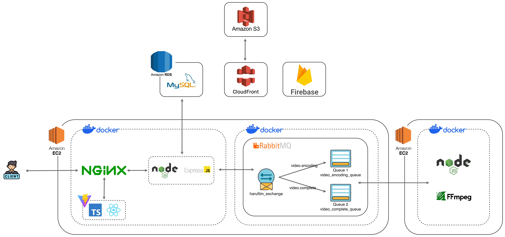
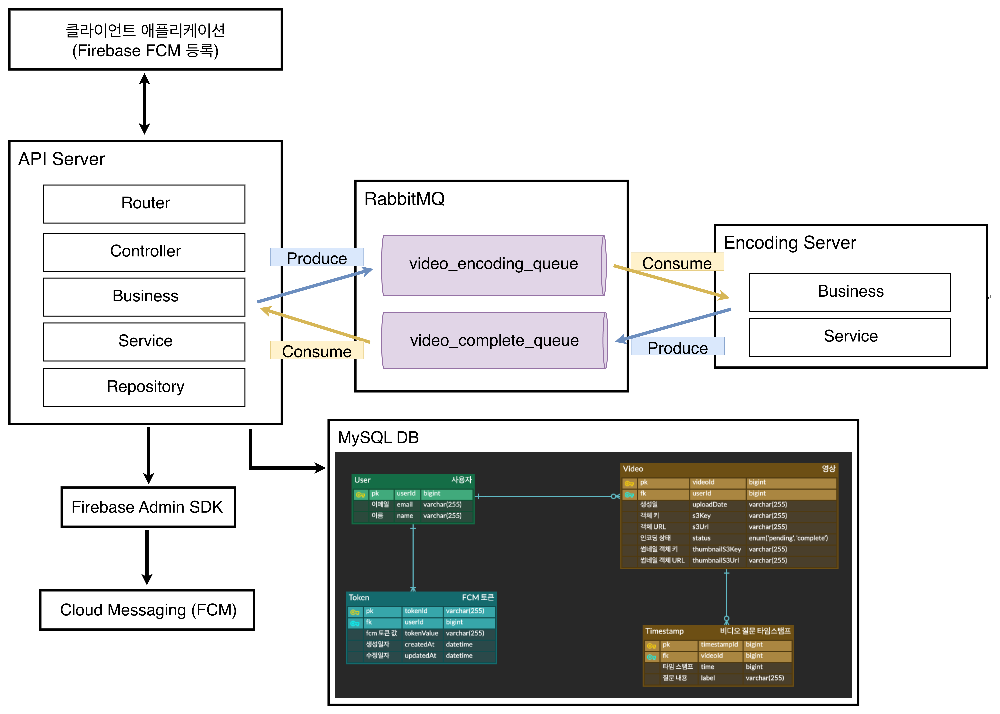
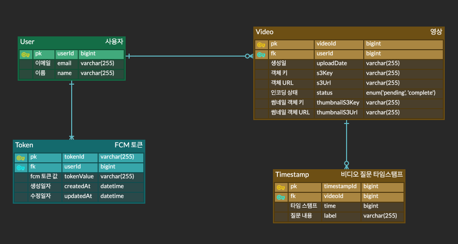
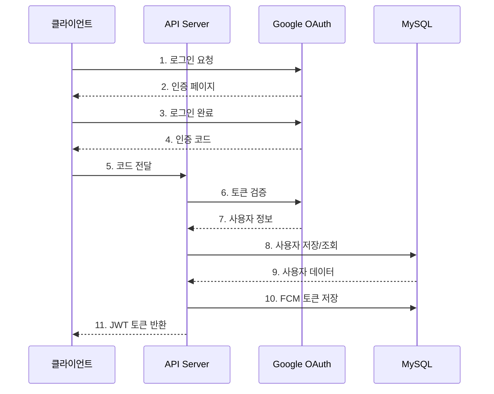
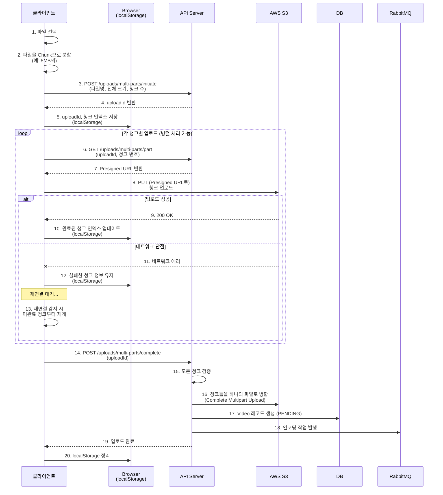
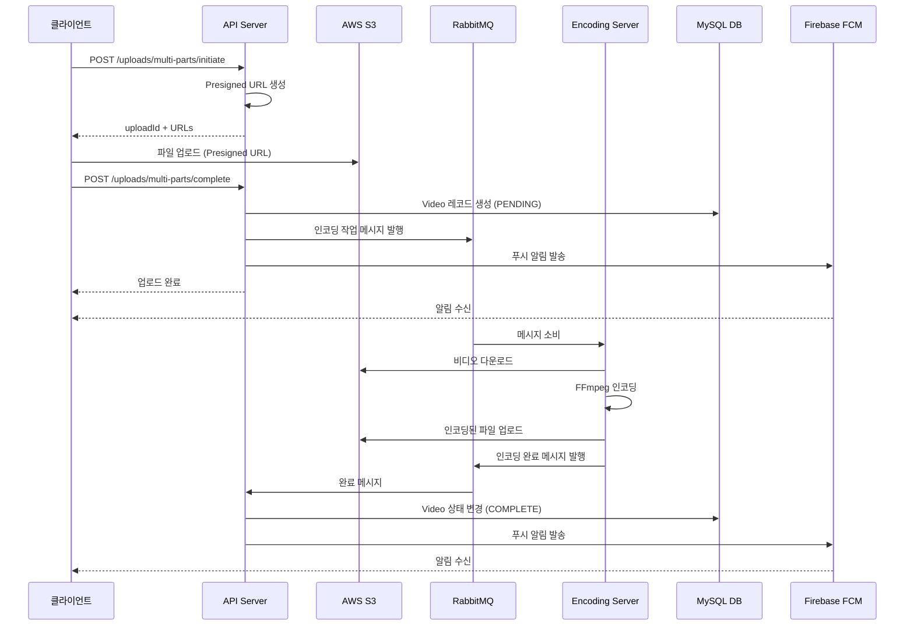
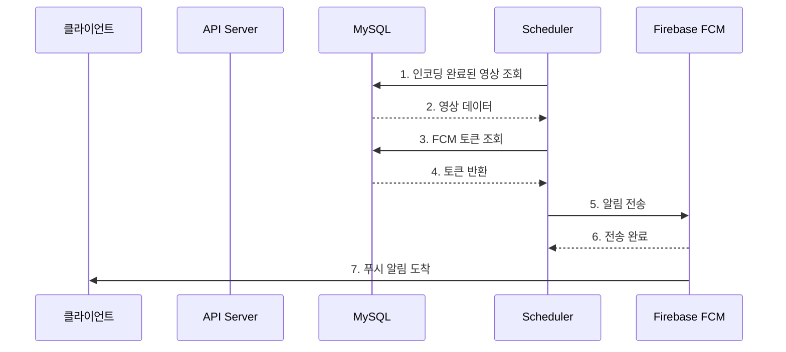

# 하루 필름 (Backend)


**Haru Film**은 일상의 소중한 순간들을 매일 기록하고 공유하는 **영상 일기 스트리밍 플랫폼**의 백엔드 Repository입니다.

Node.js를 활용하여, 네트워크 단절 상황을 극복하고, 사용자의 대기 시간을 최소화하며 시스템 리소스를 최적화하는데 초점을 맞췄습니다.

## 🛠️ Tech Stack


## 🏁 Getting Started

### Environment Setup

`.env` 파일을 생성하고 환경 변수를 설정해주세요. (`api-server`, `encoding-server`)

### Requirements & Run

- Docker

```bash
docker compose up --build
```

## 🏗️ 프로젝트 구조

- **마이크로서비스 아키텍처**: API 서버와 Encoding 서버 분리
- **비동기 처리**: RabbitMQ를 통한 메시지 기반 통신
- **의존성 주입**: container.js를 통한 중앙 DI 관리
- Router → Controller → Business(비지니스 로직) → Service(상세 구현) → Repository 계층 분리

<details>
<summary><h3>디렉토리 구조</h3></summary>

```text
harufilm-backend/
├── docker-compose.yml          # 도커 컴포즈
│
├── api-server/                 # API 서버 (Node.js, Express)
│   ├── Dockerfile
│   ├── server.js              # 서버 진입점
│   ├── prisma/                # DB 스키마
│   │   └── schema.prisma
│   └── src/
│       ├── app.js             # Express 앱 설정
│       ├── container.js       # 의존성 주입 컨테이너 (DI)
│       ├── business/          # 비즈니스 로직 계층
│       │   ├── auth.business.js
│       │   ├── ...
│       │   └── video.business.j
│       ├── controllers/       # 컨트롤러 계층 (요청 처리)
│       │   ├── auth.controller.js
│       │   ├── ...
│       │   └── video.controller.js
│       ├── domain/           # 도메인 객체 및 저장소 계층
│       │   └── repositories/
│       │       ├── token.repository.js
│       │       ├── ...
│       │       └── video.repository.js
│       ├── middlewares/      # 미들웨어
│       │   ├── auth.middleware.js (JWT 검증)
│       │   └── error-handler.middleware.js
│       ├── routes/           # 라우터 정의
│       │   ├── auth.router.js
│       │   ├── ...
│       │   └── video.router.js
│       └── services/         # 서비스 계층 (비지니스 로직의 구현)
│           ├── auth/
│           ├── ...
│           └── video/
│
└── encoding-server/           # 영상 인코딩 워커 (Node.js)
    ├── Dockerfile
    └── src/
        ├── container.js       # 의존성 주입
        ├── worker.js
        ├── business/
        │   └── encoding.business.js
        └── services/
            ├── encoding/
            ├── rabbitmq/
            └── s3/
```

</details>

<details>
<summary><h3>의존성 주입 (DI Container)</h3></summary>

```javascript
// 1. DB 및 외부 클라이언트
const s3Client = new S3Client({ region: process.env.AWS_REGION });

// 2. Repository 계층
const userRepository = new UserRepository(prisma);
const videoRepository = new VideoRepository(prisma);

// 3. Service 계층 (Repository 의존)
const authService = new AuthService();
const s3Service = new S3Service(s3Client, s3BucketName);
const userService = new UserService(userRepository);

// 4. Business 계층 (Service 의존)
const authBusiness = new AuthBusiness(authService, userService, tokenService, fcmService);

// 5. Controller 계층 (Business 의존)
const authController = new AuthController(authBusiness);

```

</details>

### Service Architecture



### Backend Architecture



### ERD



## 🧰 기술적 특징

<details>
<summary><h3>1. OAuth Google 소셜 로그인</h3></summary>

> 라이브러리 의존 없이 직접 OAuth Google 소셜 로그인을 구현했습니다.



</details>

<details>
<summary><h3>2. 네트워크 단절을 극복하는 Resumable Upload</h3></summary>

**문제 상황 (Problem) :** 모바일 환경 특성상 지하철 등에서 네트워크가 끊기면, 고용량 영상 업로드가 처음부터 다시 시작되어야 하는 문제가 있었습니다.

**해결 방안 (Solution) :**

1. Chunk 분할: 클라이언트에서 파일을 일정 크기의 조각(Chunk)으로 분할합니다.
2. 멀티파트 업로드: 대용량 파일도 안정적으로 업로드합니다.
2. Presigned URL: 각 조각별로 보안 서명된 URL을 발급받아 S3로 직접 전송합니다. (서버 부하 감소)
3. 상태 추적: localStorage에 업로드 성공한 조각 정보를 기록합니다.
4. 재개(Resume): 네트워크 재연결 시, 실패하거나 전송되지 않은 조각부터 업로드를 이어갑니다.
5. 업로드 실패 시 자동 롤백: 부분 데이터 자동 정리합니다.


</details>

<details>
<summary><h3>3. Message Queue를 활용한 비동기 인코딩 처리</h3></summary>

**문제 상황 (Problem) :** 고화질 영상을 다양한 해상도(ABR 적용 등)로 변환하는 인코딩 작업은 CPU 부하가 매우 큽니다. API 서버가 이 작업을 직접 처리할 경우, 요청이 몰리면 서버가 멈추거나 타임아웃이 발생할 위험이 있었습니다.

**해결 방안 (Solution) :** RabbitMQ를 도입하여 API 서버와 인코딩 서버를 물리적으로 분리했습니다.
- FFmpeg 기반 자동 변환: H.264 코덱으로 최적화합니다.
- HLS 스트리밍 포맷: 다양한 해상도 자동 생성합니다.
    - 360p (저화질, 빠른 로딩)
    - 720p (중화질, 균형)
    - 1080p (고화질, 최고 품질)
- 비동기 처리: 인코딩 중 다른 작업 가능합니다.
- 자동 정리: 인코딩 완료 후 임시 파일 자동 삭제합니다.



</details>

<details>
<summary><h3>4. 영상 일기 조회</h3></summary>

- 월별 조회: 월별 파티셔닝을 통해 특정 월의 모든 비디오 썸네일을 캘린더 형태로 제공합니다.
- 오늘의 피드: 오늘 업로드된 비디오 여부에 따라, (존재시) 과거 영상을 3개를 랜덤으로 제공합니다.
- 특정 날짜 조회: 특정 날짜의 비디오 + 타임스탬프 조회를 제공합니다.

</details>

<details>
<summary><h3>5. 과거 영상 랜덤 조회 쿼리 최적화</h3></summary>

하루 필름 서비스는 당일의 영상이 존재시에, 과거 영상을 3개를 랜덤으로 추출합니다.

> `VideoRepository.findRandomPastVideos()` 에서 과거 영상 3개를 조회시의 문제를 개선했습니다.

### ❌ 기존의 문제 상황
- **2개 쿼리**: 모든 과거 영상 조회 → 다시 3개 조회
- **메모리 낭비**: 모든 과거 영상을 배열로 로드 후 메모리에서 셔플
- **불필요한 연산**: Fisher-Yates 셔플 알고리즘 (O(n))

```javascript
// 1️⃣ Query 1: 모든 과거 영상 ID 조회
const allPastVideos = await this.prisma.video.findMany({...});

// 2️⃣ 메모리 연산: 셔플 (O(n))
const shuffledIds = allPastVideos.map(v => v.videoId);
for (let i = shuffledIds.length - 1; i > 0; i--) {
    const j = Math.floor(Math.random() * (i + 1));
    [shuffledIds[i], shuffledIds[j]] = [shuffledIds[j], shuffledIds[i]];
}

// 3️⃣ Query 2: 3개 다시 조회
const rows = await this.prisma.video.findMany({
    where: { videoId: { in: randomIds } }
});
```

###  ✅ 개선 내용

이러한 문제를 **1개 SQL 쿼리 + 병렬 timestamps 조회**로 개선했습니다.
- [x] SQL의 ORDER BY RAND() 활용
- [x] 1개의 쿼리로 DB에서 직접 랜덤 정렬 + 3개만 반환

```javascript
// ✅ SQL의 ORDER BY RAND()
const rows = await this.prisma.$queryRaw`
    SELECT videoId, uploadDate, thumbnailS3Url
    FROM Video
    WHERE userId = ${userIdBigInt}
    AND uploadDate < ${todayDate}
    AND status = 'COMPLETE'
    AND s3Url IS NOT NULL
    ORDER BY RAND()
    LIMIT ${limit}
`;

// ✅ Timestamps 병렬 조회 (Promise.all)
const videosWithTimestamps = await Promise.all(
    rows.map(async (video) => {
        const timestamps = await this.prisma.timestamp.findMany({...});
        return { videoId, uploadDate, thumbnailS3Url, timestamps };
    })
);
```

</details>

<details>
<summary><h3>6. Token 기반의 FCM 푸시 알림</h3></summary>

> 하루필름 서비스는 다음과 같은 상황에 사용자에게 푸시 알림을 전송합니다. 
1. **사용자에게 매일 20시 영상 업로드 리마인드 알림**
    - 당일 영상을 촬영하지 않은 사용자 대상으로 전송
    - 오늘의 질문 리스트 제공
2. **영상 업로드 성공/실패 알림**
3. **영상 인코딩 작업 성공/실패 알림**

#### Token 기반의 개별 푸시 알림 전송
> 하루 필름 프로젝트의 요구사항을 분석해보면 **Token 기반의 개별 전송 방식**이 적합하다 판단했습니다.

1. **조건부 발송:** **당일 영상을 촬영하지 않은 사용자**라는 조건은 FCM Topic으로는 처리할 수 없습니다. 서버 DB를 조회해서 대상을 선별해야 합니다.
2. **1:1 트랜잭션 알림:** 영상 업로드/인코딩 성공 여부는 특정 사용자 한 명에게만 해당하는 정보입니다.
3. **구독/해지 기능 없음:** 구독/해지 없이 알림을 전부 강제로 보낼 것이기 때문에 Topic 구독 관리(subscribe/unsubscribe)가 필요 없습니다.

따라서, **사용자와 1:N으로 매핑되는 Token 테이블만 관리**하고, 서버에서 로직을 통해 대상을 필터링하여 보내는 구조가 적합하다 판단 했습니다.
#### 정리
1. **구조:** **Token 기반,** Topic은 사용하지 않습니다.
2. **테이블:**
    - `Token` 엔티티 하나만 추가하여 `User`와 1:N 관계
    - 한 사람의 디바이스가 여러 개일 수 있으니 1:N 으로 맵핑
3. **구현:**
    - **스케줄러:** 매일 20시에 `Video` 테이블 조회 후 없는 사람만 필터링하여 일괄 전송
    - **비동기 처리:** 업로드/인코딩은 작업이 끝나는 시점에 해당 사용자의 토큰을 찾아 즉시 전송, **이는 API 응답에 영향을 주지 않는 비동기 작업으로 처리**

#### 알림 전송 Flow



</details>

<details>
<summary><h3>7. 하루 필름 푸시 알림 특징</h3></summary>

- 알림 오류가 메인 로직에 영향이 없습니다. API 응답과의 관계없는 비동기로 진행됩니다.
- 인코딩 및 업로드 성공/실패 모두 알림을 제공하기에, 사용자가 항상 결과 인지 가능합니다.
- 500개 토큰 배치 처리를 통해 알림을 나눠서 전송하기에, 사용자 수나 디바이스 수가 많아도 알림 기능을 지원 가능합니다.
- 모든 동작 추적하기 위해, 상세하게 로깅을 진행했습니다.
- 모든 등록 기기에 푸시 알림이 전송되며, 무효화된 토큰을 자동으로 삭제하여 관리합니다.

</details>

<details>
<summary><h3>8. 일일 리마인드 알림 전송 로직 최적화</h3></summary>

> 알림 전송 로직을 토큰 기반 배치 처리로 최적화를 진행했습니다.


### ❌ 기존의 성능 병목
- **사용자 루프**: 오늘 영상 없는 사용자마다 개별 처리
- **반복되는 토큰 조회**: 각 사용자의 토큰을 매번 별도로 조회 (findByUserId)
- **결과**: 500명 사용자 = 500번 반복 + 500번 토큰 조회

```javascript
// NotificationScheduler.sendDailyRemind()
for (const user of usersWithoutTodayVideo) {
    const tokens = await this.tokenRepository.findByUserId(user.userId);  // ← 루프 내 쿼리!
    await this.fcmService.sendDailyReminder(user.userId, questions);
}
```

### ✅ 개선 내용

- [x] VideoRepository.findUsersWithoutTodayVideo() 개선
    - 쿼리 2번 + 메모리 필터링 -> 한번의 쿼리 : 토큰 정보를 함께 조회하는 LEFT JOIN 쿼리로 개선 (메모리 필터링 X)
- [x] NotificationScheduler.sendDailyRemind() 리팩토링
    - 루프 기반의 500회 개별 처리 -> 배치 방식으로 변경 (0회, 루프 제거)
- [x] Test를 위해 리마인드 알림 간격 10분으로 변경
- [x] FCM Service 배치 메서드 추가
    - 사용자 기반의 알림 전송 -> Token 기반의 알림 전송으로 수정
    - API 호출: 500회 → 1-2회

</details>

<details>
<summary><h3>9. 전역 커스텀 에러 처리</h3></summary>

> 모든 API에서 동일한 에러 응답 형식 제공하고, 도메인별 커스텀 에러를 정의합니다.

1. **모든 에러는 CustomError를 상속받은 클래스를 사용**
2. **각 도메인별로 구체적인 에러 클래스 정의**
3. **Controller에서 모든 에러를 next()로 전달**
4. **Error Handler Middleware에서 일괄 처리**

### 에러 처리 컨벤션

1. **모든 에러는 CustomError 사용**
   ```javascript
   import { UserNotFoundError } from '../errors/CustomError.js';
   throw new UserNotFoundError('사용자를 찾을 수 없습니다.');
   ```
2. **Controller는 next(error) 호출**
   ```javascript
   try {
       const result = await this.business.doSomething();
       res.status(200).json(result);
   } catch (error) {
       next(error);
   }
   ```
3. **도메인별 에러 클래스 우선 사용**
    - ✅ `UserNotFoundError` (자동으로 에러 코드 `USER_NOT_FOUND` 설정)
    - ❌ `NotFoundError('message', 'USER_NOT_FOUND')` (수동 입력)
4. **구체적인 에러 메시지**
    - ✅ `'uploadId, parts, uploadDate가 필요합니다.'`
    - ❌ `'파라미터 누락'`


### 에러 응답 예시

<details>
<summary><h4>✅ 성공 응답 예시</h4></summary>

```json
{
  "videoId": "123",
  "uploadDate": "2025-12-06",
  "status": "COMPLETE"
}
```

</details>

<details>
<summary><h4>❌ 에러 응답 예시</h4></summary>

```json
{
  "success": false,
  "errorCode": "USER_NOT_FOUND",
  "message": "사용자를 찾을 수 없습니다."
}
```
</details>

### 코드 적용 예시

<details>
<summary>Controller 예시</summary>

```javascript
import { MissingUploadDataError } from '../errors/CustomError.js';
async upload(req, res, next) {
    try {
        const { uploadDate } = req.body;
        if (!uploadDate) {
            throw new MissingUploadDataError('uploadDate가 필요합니다.');
        }
        const result = await this.uploadBusiness.upload(uploadDate);
        res.status(200).json(result);
    } catch (error) {
        next(error);
    }
}
```

</details>

<details>
<summary>Service 예시</summary>

```javascript
import { GoogleAuthError } from '../../errors/CustomError.js';
async getGoogleTokens(code) {
    const response = await fetch(GOOGLE_TOKEN_URL, {...});
    if (!response.ok) {
        throw new GoogleAuthError('구글 토큰을 가져오는데 실패했습니다.');
    }
    return await response.json();
}
```

</details>

<details>
<summary>Repository 예시</summary>

```javascript
import { DatabaseError, VideoNotFoundError } from '../../errors/CustomError.js';
async findById(videoId) {
    try {
        return await this.prisma.video.findUnique({ where: { videoId } });
    } catch (error) {
        console.error('DB 에러:', error);
        if (error.code === 'P2025') {
            throw new VideoNotFoundError('비디오를 찾을 수 없습니다.');
        }
        throw new DatabaseError('DB 작업에 실패했습니다.');
    }
}
```

</details>

#### 레이어별 적용
- **Repository** : DB 에러 처리
- **Service** : 외부 API 에러 변환
- **Business** : 비즈니스 로직 검증
- **Middleware** : 인증/인가 에러
- **Controller** : 요청 검증
- **Scheduler** : 스케줄러 에러 로깅

<details>
<summary><h3>전체 에러 코드 목록</h3></summary>

| 에러 코드 | HTTP | 도메인 | 설명 |
|----------|------|--------|------|
| `INVALID_TOKEN` | 401 | Auth | 토큰 없음/형식 오류 |
| `TOKEN_EXPIRED` | 401 | Auth | 토큰 만료 |
| `INVALID_REFRESH_TOKEN` | 401 | Auth | 리프레시 토큰 오류 |
| `GOOGLE_AUTH_FAILED` | 500 | Auth | Google OAuth 실패 |
| `USER_NOT_FOUND` | 404 | User | 사용자 없음 |
| `USER_ALREADY_EXISTS` | 409 | User | 사용자 중복 |
| `VIDEO_NOT_FOUND` | 404 | Video | 비디오 없음 |
| `VIDEO_ALREADY_EXISTS` | 409 | Video | 비디오 중복 |
| `VIDEO_ENCODING_FAILED` | 500 | Video | 인코딩 실패 |
| `INVALID_VIDEO_FORMAT` | 400 | Video | 잘못된 포맷 |
| `UPLOAD_INITIATION_FAILED` | 500 | Upload | 업로드 시작 실패 |
| `UPLOAD_COMPLETION_FAILED` | 500 | Upload | 업로드 완료 실패 |
| `INVALID_UPLOAD_PART` | 400 | Upload | 파트 정보 오류 |
| `MISSING_UPLOAD_DATA` | 400 | Upload | 데이터 누락 |
| `S3_UPLOAD_FAILED` | 500 | S3 | S3 업로드 실패 |
| `S3_DELETE_FAILED` | 500 | S3 | S3 삭제 실패 |
| `S3_URL_GENERATION_FAILED` | 500 | S3 | URL 생성 실패 |
| `INVALID_FCM_TOKEN` | 400 | FCM | FCM 토큰 오류 |
| `FCM_SEND_FAILED` | 500 | FCM | 알림 전송 실패 |
| `DATABASE_ERROR` | 500 | Database | DB 작업 실패 |
| `DATABASE_CONNECTION_FAILED` | 503 | Database | DB 연결 실패 |
| `MESSAGE_QUEUE_ERROR` | 500 | RabbitMQ | 큐 에러 |
| `MESSAGE_PUBLISH_FAILED` | 500 | RabbitMQ | 메시지 발행 실패 |

</details>

</details>


## 🧩 라이브러리 사용

### API Server 주요 라이브러리 및 버전

| **라이브러리** | **버전** | **용도** |
| --- | --- | --- |
| **express** | ^5.1.0 | 웹 프레임워크 |
| **@prisma/client** | ^6.18.0 | ORM (DB 쿼리 빌더) |
| **firebase-admin** | ^13.6.0 | Firebase Admin SDK (FCM 푸시 알림) |
| **@aws-sdk/client-s3** | ^3.925.0 | AWS S3 클라이언트 |
| **@aws-sdk/s3-request-presigner** | ^3.925.0 | S3 Presigned URL 생성 |
| **amqplib** | ^0.10.9 | RabbitMQ 클라이언트 |
| **jsonwebtoken** | ^9.0.2 | JWT 토큰 생성/검증 |
| **node-schedule** | ^2.1.1 | 스케줄러 (정기적인 작업) |
| **cookie-parser** | ^1.4.7 | 쿠키 파싱 |
| **cors** | ^2.8.5 | CORS 처리 |
| **dotenv** | ^17.2.3 | 환경변수 로드 |

### Encoding Server 주요 라이브러리 및 버전

| **라이브러리** | **버전** | **용도** |
| --- | --- | --- |
| **@ffmpeg-installer/ffmpeg** | ^1.1.0 | FFmpeg 바이너리 (비디오 인코딩) |
| **multer** | ^2.0.2 | 파일 업로드 미들웨어 |
| **multer-s3** | ^3.0.1 | S3에 직접 업로드 |
| **amqplib** | ^0.10.9 | RabbitMQ 클라이언트 |
| **@aws-sdk/client-s3** | ^3.925.0 | AWS S3 클라이언트 |
| **@aws-sdk/s3-request-presigner** | ^3.925.0 | S3 Presigned URL |
| **dotenv** | ^17.2.3 | 환경변수 로드 |
