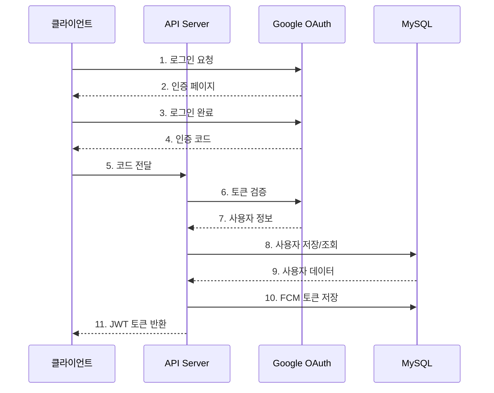
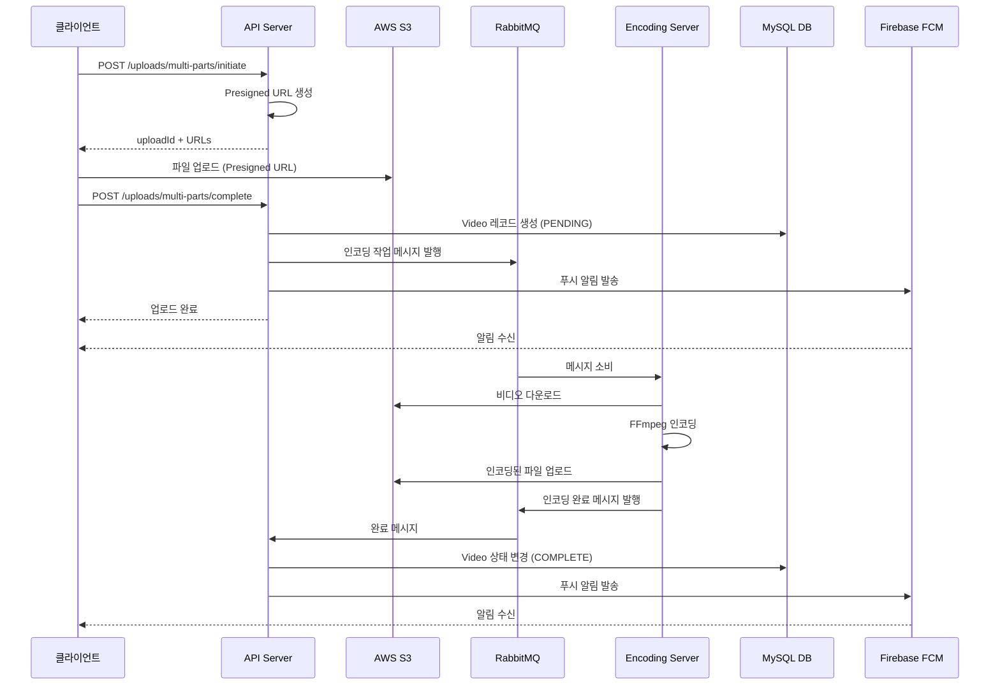
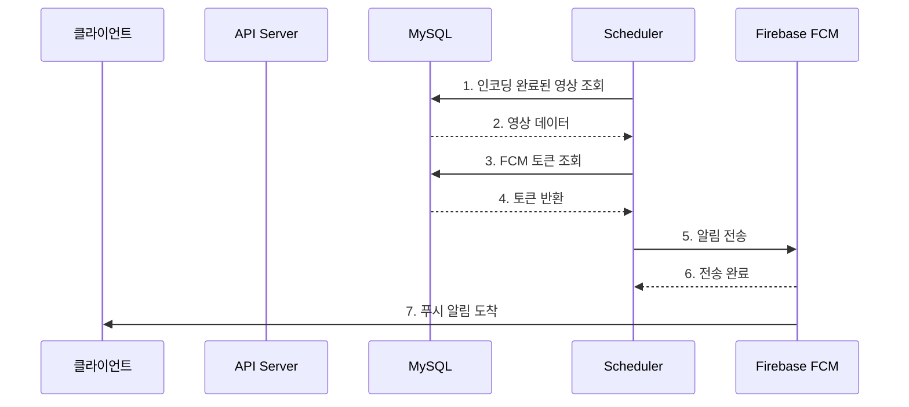

## **🎬  하루필름 서비스 소개**

**Haru Film**은 일상의 소중한 순간들을 매일 기록하고 공유하는 $\bf{\color{#E53935}일일\ 영상\ 일기\ 스트리밍\ 플랫폼}$ 입니다.
- 🎥 **하루 1개 비디오 업로드**
- 🎞️ **자동 인코딩**
- 📅 **시간 기반 타임스탬프**
- 📸 **썸네일 생성**
- 🔔 **푸시 알림**
- 🔐 **Google OAuth**

<details>

<summary><h3>1. 비디오 업로드</h3></summary>

- **멀티파트 업로드**: 대용량 파일도 안정적으로 업로드
- **Presigned URL 사용**: 클라이언트가 S3에 직접 업로드 (서버 부하 감소)
- **청크 기반 전송**: 네트워크 불안정해도 업로드 재개 가능
- **업로드 실패 시 자동 롤백**: 부분 데이터 자동 정리

</details>

<details>

<summary><h3>2. 비디오 인코딩 (백그라운드)</h3></summary>

- **FFmpeg 기반 자동 변환**: H.264 코덱으로 최적화
- **HLS 스트리밍 포맷**: 다양한 해상도 자동 생성
    - 360p (저화질, 빠른 로딩)
    - 720p (중화질, 균형)
    - 1080p (고화질, 최고 품질)
- **비동기 처리**: 인코딩 중 다른 작업 가능
- **자동 정리**: 인코딩 완료 후 임시 파일 자동 삭제

</details>

<details>

<summary><h3>3. 비디오 조회</h3></summary>

- **월별 조회**: 특정 월의 모든 비디오 조회
- **오늘의 피드**: 오늘 업로드된 비디오 조회
- **특정 날짜 조회**: 특정 날짜의 비디오 + 타임스탐프 조회
- **검색**: 업로드 날짜, 상태 등으로 필터링

</details>

<details>

<summary><h3>4. 푸시 알림 (FCM)</h3></summary>

- **업로드 알림**: "업로드가 완료되었습니다!"
- **인코딩 완료 알림**: "비디오 인코딩이 완료되었습니다!"
- **영상 업로드 리마인드 알림**: "오늘 하루를 기록하세요!"
- **토큰 관리**: 기기별 고유 FCM 토큰으로 개인화 알림

</details>

## **🏗️ 시스템 아키텍처**


## **📁 벡엔드 아키텍처**

- **마이크로서비스 아키텍처**: API 서버와 Encoding 서버 분리
- **비동기 처리**: RabbitMQ를 통한 메시지 기반 통신
- **의존성 주입**: container.js를 통한 중앙 DI 관리
- Router → Controller → Business(비지니스 로직) → Service(상세 구현) → Repository 계층 분리

<details>
<summary><h3>디렉토리 구조</h3></summary>

```
harufilm-backend/
├── docker-compose.yml          # 도커 컴포즈
│
├── api-server/                 # API 서버 (Node.js, Express)
│   ├── Dockerfile
│   ├── server.js              # 서버 진입점
│   ├── prisma/                # DB 스키마
│   │   └── schema.prisma
│   └── src/
│       ├── app.js             # Express 앱 설정
│       ├── container.js       # 의존성 주입 컨테이너 (DI)
│       ├── business/          # 비즈니스 로직 계층
│       │   ├── auth.business.js
│       │   ├── ...
│       │   └── video.business.j
│       ├── controllers/       # 컨트롤러 계층 (요청 처리)
│       │   ├── auth.controller.js
│       │   ├── ...
│       │   └── video.controller.js
│       ├── domain/           # 도메인 객체 및 저장소 계층
│       │   └── repositories/
│       │       ├── token.repository.js
│       │       ├── ...
│       │       └── video.repository.js
│       ├── middlewares/      # 미들웨어
│       │   ├── auth.middleware.js (JWT 검증)
│       │   └── error-handler.middleware.js
│       ├── routes/           # 라우터 정의
│       │   ├── auth.router.js
│       │   ├── ...
│       │   └── video.router.js
│       └── services/         # 서비스 계층 (비지니스 로직의 구현)
│           ├── auth/
│           ├── ...
│           └── video/
│
└── encoding-server/           # 영상 인코딩 워커 (Node.js)
    ├── Dockerfile
    └── src/
        ├── container.js       # 의존성 주입
        ├── worker.js
        ├── business/
        │   └── encoding.business.js
        └── services/
            ├── encoding/
            ├── rabbitmq/
            └── s3/
```

</details>

<details>
<summary><h3>의존성 주입 (DI Container)</h3></summary>

```javascript
// 1. DB 및 외부 클라이언트
const s3Client = new S3Client({ region: process.env.AWS_REGION });

// 2. Repository 계층
const userRepository = new UserRepository(prisma);
const videoRepository = new VideoRepository(prisma);

// 3. Service 계층 (Repository 의존)
const authService = new AuthService();
const s3Service = new S3Service(s3Client, s3BucketName);
const userService = new UserService(userRepository);

// 4. Business 계층 (Service 의존)
const authBusiness = new AuthBusiness(authService, userService, tokenService, fcmService);

// 5. Controller 계층 (Business 의존)
const authController = new AuthController(authBusiness);

```

</details>

## **💾 데이터베이스 스키마**


## **🔄 User Flow (사용자 흐름)**

<details>
<summary><h3>OAuth Google 소셜 로그인 플로우</h3></summary>



</details>

### **비디오 업로드 및 인코딩 플로우**



### FCM 푸시 알림 플로우


<details>
<summary><b>FCM 푸시 알림 플로우</b></summary>



</details>

## **🔧 핵심 기술 스택**

| **카테고리** | **기술** |
| --- | --- |
| **웹 프레임워크** | Express.js (Node.js) |
| **ORM** | Prisma |
| **데이터베이스** | MySQL |
| **클라우드 저장소** | AWS S3 |
| **메시지 큐** | RabbitMQ |
| **인증** | Google OAuth 2.0, JWT |
| **푸시 알림** | Firebase Cloud Messaging (FCM) |
| **비디오 처리** | FFmpeg |
| **파일 업로드** | multer, multer-s3 |
| **컨테이너화** | Docker, Docker Compose |

<details>
<summary><h3>API Server 주요 라이브러리 및 버전</h3></summary>

| **라이브러리** | **버전** | **용도** |
| --- | --- | --- |
| **express** | ^5.1.0 | 웹 프레임워크 |
| **@prisma/client** | ^6.18.0 | ORM (DB 쿼리 빌더) |
| **firebase-admin** | ^13.6.0 | Firebase Admin SDK (FCM 푸시 알림) |
| **@aws-sdk/client-s3** | ^3.925.0 | AWS S3 클라이언트 |
| **@aws-sdk/s3-request-presigner** | ^3.925.0 | S3 Presigned URL 생성 |
| **amqplib** | ^0.10.9 | RabbitMQ 클라이언트 |
| **jsonwebtoken** | ^9.0.2 | JWT 토큰 생성/검증 |
| **node-schedule** | ^2.1.1 | 스케줄러 (정기적인 작업) |
| **cookie-parser** | ^1.4.7 | 쿠키 파싱 |
| **cors** | ^2.8.5 | CORS 처리 |
| **dotenv** | ^17.2.3 | 환경변수 로드 |

</details>

<details>
<summary><h3>Encoding Server 주요 라이브러리 및 버전</h3></summary>

| **라이브러리** | **버전** | **용도** |
| --- | --- | --- |
| **@ffmpeg-installer/ffmpeg** | ^1.1.0 | FFmpeg 바이너리 (비디오 인코딩) |
| **multer** | ^2.0.2 | 파일 업로드 미들웨어 |
| **multer-s3** | ^3.0.1 | S3에 직접 업로드 |
| **amqplib** | ^0.10.9 | RabbitMQ 클라이언트 |
| **@aws-sdk/client-s3** | ^3.925.0 | AWS S3 클라이언트 |
| **@aws-sdk/s3-request-presigner** | ^3.925.0 | S3 Presigned URL |
| **dotenv** | ^17.2.3 | 환경변수 로드 |

</details>